### I build software people use. Most of it is open source.

AI engineer in Pakistan. I ship products, contribute upstream, and run developer communities offline. Before this I wrote the problems that train frontier models at Turing.

<picture>
  <source media="(prefers-color-scheme: dark)" srcset="./assets/stats-dark.svg">
  <source media="(prefers-color-scheme: light)" srcset="./assets/stats-light.svg">
  
</picture>

## Things I've shipped

Every one of these is live somewhere you can reach it: a store listing, a repo, or a working site.

<table>
<tr>
<td width="50%" valign="top">

**[blyn](https://apps.apple.com/us/app/blyn-ai-money-coach/id6799817602)** &nbsp;`iOS app`

An AI money coach that runs on your phone instead of someone else's server. It reads your spending, holds category limits, and tells you what's left. The data never leaves the device.

🟢 Live on the App Store · <a href="https://apps.apple.com/us/app/blyn-ai-money-coach/id6799817602">App Store ↗</a>

</td>
<td width="50%" valign="top">

**[Divisio](https://github.com/junaiddshaukat/Divisio)** &nbsp;`macOS app`

Claude Code, Codex, Cursor, Grok and five more agents in one window. Each gets its own git worktree, sessions stay warm (1.5s to first token, down from 5.9s), and nothing lands until you've read the diff.

🟢 Open source, MIT · <a href="https://github.com/junaiddshaukat/Divisio/releases/latest">Download ↗</a> · <a href="https://junaidshaukat.com/divisio">Website ↗</a>

</td>
</tr>
<tr>
<td width="50%" valign="top">

**[isDisposable](https://isdisposable.com)** &nbsp;`API + SDKs`

Throwaway email detection. 160,000 domains, live DNS checks, a risk score. There's an API, plus offline SDKs for npm and PyPI for when you can't make a network call.

🟢 <!--stat:isdisposable_npm-->57.9k<!--/stat--> npm downloads · <a href="https://isdisposable.com">Website ↗</a> · <a href="https://github.com/isdisposable/js">SDK ↗</a>

</td>
<td width="50%" valign="top">

**[tkntracker](https://github.com/junaiddshaukat/tkntracker)** &nbsp;`CLI`

Run `tkntracker web` and see how many tokens you burn across Claude Code, Codex, Cursor, Grok, OpenCode and 19 more agents. It reads local logs only. No account, no API keys.

🟢 <!--stat:tkntracker_npm-->230<!--/stat--> npm downloads · <a href="https://www.npmjs.com/package/tkntracker">npm ↗</a> · <a href="https://github.com/junaiddshaukat/tkntracker">Source ↗</a>

</td>
</tr>
<tr>
<td width="50%" valign="top">

**[Storage Sweep](https://junaidshaukat.com/storage-sweep)** &nbsp;`macOS app`

A native SwiftUI cleaner. It scans Docker, Xcode, Node, Python, Rust and Go caches, labels everything Safe, Review or Protected, and only ever moves the safe ones to Trash.

🟢 Freed 25–90 GB per user · <a href="https://junaidshaukat.com/storage-sweep">Download ↗</a> · <a href="https://github.com/junaiddshaukat/StorageSweep">Source ↗</a>

</td>
<td width="50%" valign="top">

**[reqcraft](https://github.com/junaiddshaukat/reqcraft)** &nbsp;`npm package`

A 3 kB HTTP client on native `fetch` with the axios API: interceptors, retries, typed errors, zero dependencies. I wrote it the week the axios supply-chain attack landed.

🟢 Zero dependencies · <a href="https://github.com/junaiddshaukat/reqcraft">Source ↗</a> · <a href="https://junaidshaukat.com/blog/building-axios-alternative-zero-dependencies">The story ↗</a>

</td>
</tr>
</table>

**Also:** [QueryMaster](https://github.com/junaiddshaukat/querymaster), an MCP server for querying SQL in plain English · [revise-deps](https://www.npmjs.com/package/revise-deps), a dependency audit CLI · [GitHub Issue Reminder](https://chromewebstore.google.com/detail/github-issue-reminder/ddiaekdhnodoldfmdnpkcbdonhmimdbo), a Chrome extension. [Every project →](https://junaidshaukat.com/projects)

## Open source

Rebuilt every day from the GitHub API, so nothing here is typed by hand.

<!--oss:start-->

| &nbsp;&nbsp;&nbsp;&nbsp;&nbsp;&nbsp; | Project | Merged | What I did |
| :-: | :-- | :-: | :-- |
|  | <a href="https://github.com/apache/beam"><b>Apache&nbsp;Beam</b></a> | [43](https://github.com/search?type=pullrequests&q=is%3Apr%20is%3Amerged%20author%3Ajunaiddshaukat%20repo%3Aapache%2Fbeam) | Wrote the portable Kafka Streams runner, so pipelines from any Beam SDK run on Kafka Streams. Ships in the nightly snapshots. |
|  | <a href="https://github.com/InsForge/InsForge"><b>InsForge</b></a> | [12](https://github.com/search?type=pullrequests&q=is%3Apr%20is%3Amerged%20author%3Ajunaiddshaukat%20repo%3AInsForge%2FInsForge%20repo%3AInsForge%2FInsForge-sdk-js%20repo%3AInsForge%2Finsforge-swift%20repo%3AInsForge%2Finsforge-kotlin) | Custom OAuth providers end to end, then carried into the JS, Swift and Kotlin SDKs. Signup controls, PostgREST operators for Kotlin, dashboard fixes. |
|  | <a href="https://github.com/archestra-ai/archestra"><b>Archestra</b></a> | [6](https://github.com/search?type=pullrequests&q=is%3Apr%20is%3Amerged%20author%3Ajunaiddshaukat%20repo%3Aarchestra-ai%2Farchestra) | Enterprise MCP gateway. Added the Mistral, Cerebras, DeepSeek and Perplexity providers, and fixed Kubernetes service names for long MCP server names. |
|  | <a href="https://github.com/PalisadoesFoundation/talawa-admin"><b>Talawa&nbsp;Admin</b></a> | [6](https://github.com/search?type=pullrequests&q=is%3Apr%20is%3Amerged%20author%3Ajunaiddshaukat%20repo%3APalisadoesFoundation%2Ftalawa-admin) | Built the i18n notification toast and moved the app onto it. Turned on advanced tree-shaking in Vite; the bundle got 30% smaller. |
|  | <a href="https://github.com/devweekends/web-platform"><b>Dev&nbsp;Weekends</b></a> | [6](https://github.com/search?type=pullrequests&q=is%3Apr%20is%3Amerged%20author%3Ajunaiddshaukat%20repo%3Adevweekends%2Fweb-platform) | The community platform. Careers, projects and testimonials pages, a security cleanup, and a self-hosted links page. |
|  | <a href="https://github.com/apache/airflow"><b>Apache&nbsp;Airflow</b></a> | [3](https://github.com/search?type=pullrequests&q=is%3Apr%20is%3Amerged%20author%3Ajunaiddshaukat%20repo%3Aapache%2Fairflow) | Fixed user creation in the FAB auth manager when no role is given. E2E tests for Asset Details. |
|  | <a href="https://github.com/voiceyBill/voiceyBill-App"><b>voiceyBill</b></a> | [3](https://github.com/search?type=pullrequests&q=is%3Apr%20is%3Amerged%20author%3Ajunaiddshaukat%20repo%3AvoiceyBill%2FvoiceyBill-App%20repo%3AvoiceyBill%2FvoiceyBill-web) | UI and auth overhauls across the mobile app and the web client. |
|  | <a href="https://github.com/google-gemini/gemini-cli"><b>Gemini&nbsp;CLI</b></a> | [2](https://github.com/search?type=pullrequests&q=is%3Apr%20is%3Amerged%20author%3Ajunaiddshaukat%20repo%3Agoogle-gemini%2Fgemini-cli) | Custom base URLs through env vars, and stricter audio MIME validation in file reads. |
|  | <a href="https://github.com/webpack/webpack"><b>webpack</b></a> | [2](https://github.com/search?type=pullrequests&q=is%3Apr%20is%3Amerged%20author%3Ajunaiddshaukat%20repo%3Awebpack%2Fwebpack) | Merged the propertyAccess and propertyName utils into one module. Config coverage for Electron targets. |
|  | <a href="https://github.com/topoteretes/cognee"><b>Cognee</b></a> | [1](https://github.com/search?type=pullrequests&q=is%3Apr%20is%3Amerged%20author%3Ajunaiddshaukat%20repo%3Atopoteretes%2Fcognee) | An incremental Gmail connector for the agent memory layer. |
|  | <a href="https://github.com/jaegertracing/jaeger"><b>Jaeger</b></a> | [1](https://github.com/search?type=pullrequests&q=is%3Apr%20is%3Amerged%20author%3Ajunaiddshaukat%20repo%3Ajaegertracing%2Fjaeger) | Timer duration bucket parsing in the metrics init. |
|  | <a href="https://www.kernel.org"><b>Linux&nbsp;kernel</b></a> | patches | Built and booted mainline on ARM64, then sent patches the old way, with git format-patch and git send-email. |

Plus 2 more in [ContextVM/sdk](https://github.com/ContextVM/sdk), [dailydotdev/apps](https://github.com/dailydotdev/apps).

<!--oss:end-->

## Community

- **Qwen Ambassador.** Founded Qwen Pakistan from an empty page: 3,000+ followers in week one, then an AI Buildathon.
- **RevenueCat Shipaton IRL.** Asked RevenueCat to host Pakistan's first one. 43 signed up, about 30 walked in.
- **Dev Weekends.** Mentor a weekly cohort of ~40 through open source and AI engineering.
- **Notion Campus Club.** Campus Leader for a year.

## Receipts

- 🏆 **Winner**, Cognee AI PR hackathon
- 🥈 **2nd place**, InsForge PR hackathon, then stayed on as a contributor
- ☀️ **Google Summer of Code 2026**, Apache Software Foundation · [project page](https://summerofcode.withgoogle.com/programs/2026/projects/x13a0jGL)
- ☸️ **Kubernetes Release Team**, Release Signal Shadow for v1.37
- 🧮 **Meta Hacker Cup 2024**, top 100 in Pakistan
- 🐧 **Linux Foundation LFD103**, kernel development

## Writing

📘 **[LLM Engineering](https://junaidshaukat.com/courses/llm-engineering)**, a free 17-lesson course, from what an LLM is to fine-tuning, serving, RAG, agents and evals.

- [How to Train a Small LLM Without Burning Money](https://junaidshaukat.com/blog/how-to-train-a-small-llm-without-burning-money)
- [More Context Is Making Your AI Dumber](https://junaidshaukat.com/blog/more-context-is-making-your-ai-dumber)
- [Agentic Loop Engineering: The Missing Infra Layer](https://junaidshaukat.com/blog/agentic-loop-engineering-missing-infra-layer)

[All posts →](https://junaidshaukat.com/blog)

## Stack

**AI:** LLM APIs, MCP, tool calling, agent loops, LangGraph, RAG, pgvector, evals, LoRA / QLoRA, vLLM, Ollama.

 

<picture>
  <source media="(prefers-color-scheme: dark)" srcset="https://raw.githubusercontent.com/junaiddshaukat/junaiddshaukat/output/snake-dark.svg">
  <source media="(prefers-color-scheme: light)" srcset="https://raw.githubusercontent.com/junaiddshaukat/junaiddshaukat/output/snake-light.svg">
  
</picture>

**Say hi:** [Email](mailto:junaidshaukat546@gmail.com) · [X](https://x.com/junaiddshaukat) · [Blog](https://junaidshaukat.com/blog) · [YouTube](https://www.youtube.com/@junaiddshaukat)
